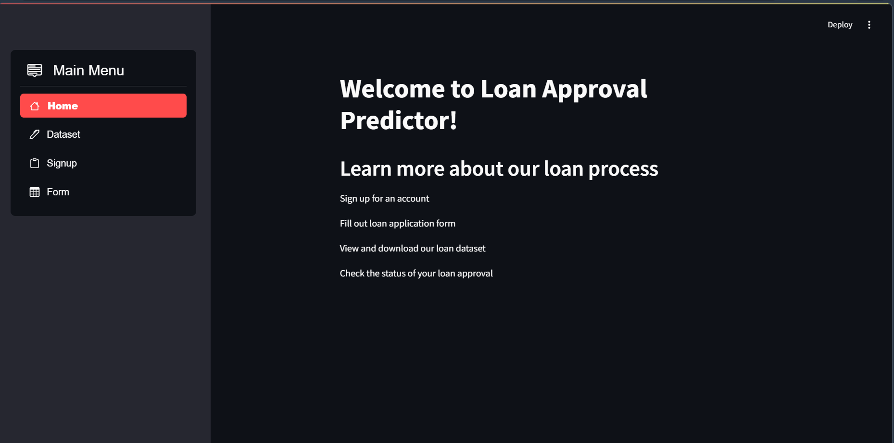
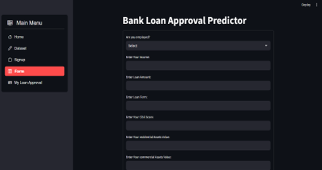
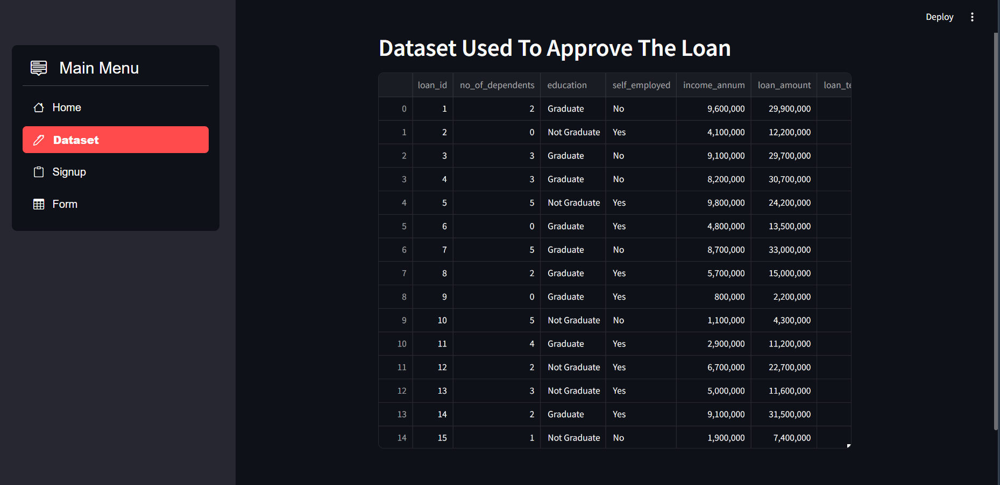

# 🏦 Bank Loan Approval Prediction – Streamlit Web App

## 📌 Project Description
This project is a machine learning–based web application developed during my
internship to predict whether a bank loan application will be approved or not.
The application is built using **Streamlit** and provides an interactive
interface for users to enter applicant details and receive instant predictions.

---

## 🌐 Application Type
- Streamlit-based Machine Learning Web Application

---

## 🛠 Technologies Used
- Python
- Streamlit
- Pandas
- NumPy
- Scikit-learn

---

## 📊 Dataset Description
The project uses multiple datasets containing applicant information such as:
- Personal details
- Loan amount and loan term
- Credit history
- Income and employment details

These datasets are used for training and evaluating the loan approval model.

---

## 🤖 Machine Learning Model
The system uses supervised machine learning algorithms to classify loan
applications as **Approved** or **Not Approved** based on applicant data.

---

## ✨ Features
- User-friendly web interface
- Real-time loan approval prediction
- Data-driven decision support
- Interactive input fields using Streamlit

---

## 🚀 How to Run the Application

1. Clone the repository:
   ```bash
   git clone https://github.com/yourusername/bank-loan-approval-streamlit-app

## 📸 Application Screenshots

### 🏠 Home Page


### 📝 User Registration Page


### 🧾 Loan Application Form


### 📊 Dataset View


